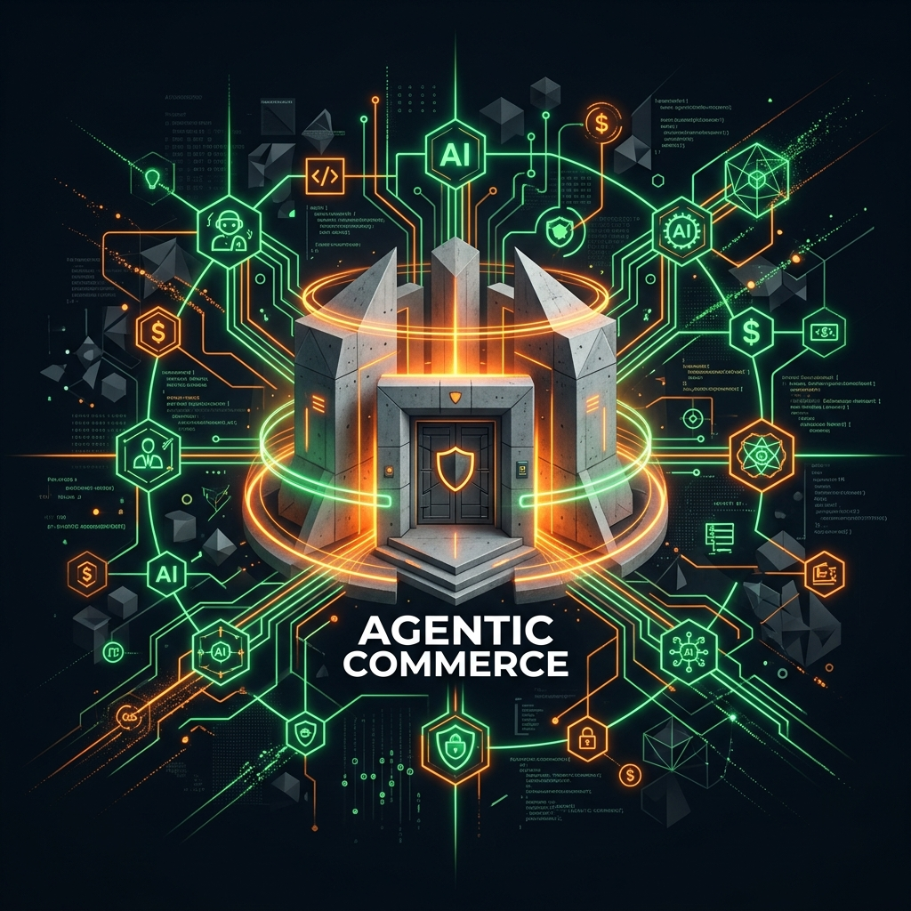
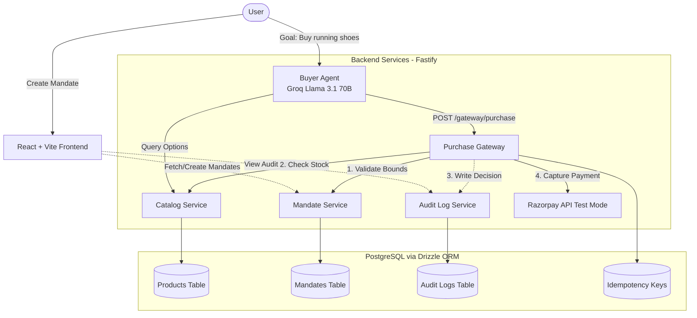

<div align="center">
  
</div>

# BoundPay: Autonomous Growth & Bounded Trust

A production-grade reference implementation of agent-to-agent commerce built for the **Razorpay AI Buildathon (Track 01)**. This system proves that you can securely unleash an autonomous AI buyer to grow a merchant's revenue, while deterministically bounding its access to money.

## 🌍 The "Why Now" (AP2 & UAP Context)
As the world races toward agent-to-agent commerce, protocols like **Google's AP2 (Agentic Payment Protocol)** and the **NPCI's UAP (Unified Agent Protocol)** are actively defining how AI systems transact safely. Razorpay is already running in-app AI checkout pilots (like Zomato and Swiggy). 

However, external 3rd-party AI agents cannot be trusted natively. **They require an authorization layer.** 

This project is a reference implementation of that missing authorization layer. It acts as a **Two-Phase Commit Gateway** that intercepts untrusted AI purchase requests, independently re-verifies them against a strict, human-issued financial **Mandate**, and safely brokers the payment through Razorpay.

## 🚀 The Solution (Fulfilling Track 01)
Track 01 asks to either "Grow the merchant's revenue" OR "Make them sellable to AI buyers". **We did both.**

1. **Sellable to AI Buyers (Trust):** We implemented a Gateway that natively understands AP2-style constraints (Budget, Categories, Expiry). It is heavily gated via API keys, enforces Idempotency, and returns standardized **RFC 7807** problem details to external agents when they are rejected.
2. **Growing Revenue (Growth):** We built an autonomous **Upsell Engine**. If a buyer agent has remaining budget after finding their primary item, the LLM actively hunts the catalog for relevant accessories and bundles them, mathematically growing the Average Order Value (AOV) for the merchant.

---

## 🛠️ Key Technical Features

### 1. Independent Gating & Bounding
The LLM is completely isolated from the Razorpay API. It submits a `PurchaseRequest` to the Gateway, which deterministically enforces constraints (database bounds check). If an agent attempts to buy a ₹1,00,000 laptop on a ₹5,000 mandate, it is violently rejected with an `AMOUNT_EXCEEDS_BUDGET` error.

### 2. Autonomous Upsell Engine
The AI reasoning engine uses Groq's GPT-OSS-120B. If given a ₹5,000 budget to buy ₹3,000 shoes, it dynamically identifies the remaining ₹2,000 gap and recommends running socks or fitness bands, firing sequential authorized orders.

### 3. Human-in-the-Loop (HITL) Interception
Not every transaction is a simple pass/fail. If an AI agent attempts a borderline transaction that consumes **90% or more of the remaining mandate budget** in a single shot, the Gateway intercepts the call. Instead of auto-approving, it triggers a `pending_human_review` state (HTTP 202), demonstrating enterprise-level risk control.

### 4. Real-time Immutable Audit Ledger
Every single money action—whether approved, failed, or rejected by the Gateway—is permanently recorded in a PostgreSQL audit ledger. The AI's internal reasoning (`agentReasoning`) is attached to the financial log for complete explainability.

### 5. Interoperable Infrastructure
This isn't a walled garden. The APIs are secured via `x-api-key`, rate-limited (60 req/min), and fully documented via standard OpenAPI schemas (`docs/openapi.yaml`), proving readiness for external ecosystem integration.

---

## 🏗️ Path to Production (Current Limitations)
As a hackathon build, this architecture takes deliberate shortcuts to prove the core trust boundary. For a true production deployment, the following gaps would be closed:
1. **Cryptographic Mandates**: Currently, mandates are database records. In production (like true AP2/UAP), mandates would be cryptographically signed JWTs or verifiable credentials passed directly from the user's wallet to the merchant.
2. **Multi-Order Atomicity**: The Upsell Engine executes sequential orders. If the primary succeeds but the upsell fails, the primary order remains. A true atomic cart checkout would require a session-based lock on the Gateway.
3. **Public Authentication & Federation**: While the Catalog and Gateway APIs are gated with API keys and robust Rate Limiting, a production system would require OAuth2/OIDC federation for true external agent interoperability.
4. **Asynchronous Webhooks**: A simulated webhook is fired in the server logs upon successful purchase, but a production system requires a resilient, retryable webhook dispatcher to notify merchants out-of-band.

---

## 🧩 Architecture



---

## 💻 Tech Stack
*   **Backend Server:** Fastify (Node.js/TypeScript)
*   **Database:** PostgreSQL (via Drizzle ORM)
*   **AI Engine:** Groq SDK (GPT-OSS-120B)
*   **Payments:** Razorpay Node SDK
*   **Frontend UI:** React + Vite + Neo-Brutalist CSS styling

---

## ⚙️ Setup & Running Locally

### Prerequisites
- Node.js (v20+)
- Docker & Docker Compose (for PostgreSQL)
- [Razorpay Test Account](https://razorpay.com/)
- [Groq API Key](https://console.groq.com/keys)

### 1. Environment Configuration
Copy the example environment file and fill in your keys:
```bash
cp .env.example .env
```
Update `.env` with:
- `RAZORPAY_KEY_ID` and `RAZORPAY_KEY_SECRET`
- `GROQ_API_KEY`

### 2. Database Setup
Start the PostgreSQL database using Docker:
```bash
docker compose up -d postgres
```

### 3. Install Dependencies
Install the backend dependencies:
```bash
npm install
```
Install the frontend dependencies:
```bash
cd frontend && npm install && cd ..
```

### 4. Run the Application
Start the backend server (this will automatically push the schema):
```bash
npm run start
```
Seed the database with demo products:
```bash
npm run seed
```
In a new terminal window, start the frontend development server:
```bash
cd frontend
npm run dev
```

The application will be available at: **http://localhost:5173**

---

## 🧪 Testing the Evaluator Scenarios

Once running, navigate to `http://localhost:5173/agent` to test the core requirements:

1. **Trigger an Upsell (Growth):** 
   * Provide a budget of ₹5,000 and ask for a ₹3,000 product. 
   * *Observation:* Watch the AI reasoning engine autonomously hunt down an accessory to maximize the remaining ₹2,000. Navigate to the Audit Dashboard to see the "AI Upsell Revenue" metrics climb.
2. **Trigger a Rejection (Gating):** 
   * Tell the agent to buy a product outside its allowed categories (e.g., Electronics).
   * *Observation:* Watch the Gateway intercept and violently reject the purchase. The attempt, along with the AI's internal reasoning, will be permanently recorded in the Audit Log.
3. **Run the Safety Tests:**
   * Run `npm test` to execute the exhaustive test suite verifying the Two-Phase Commit Gateway and Mandate validation rules.
